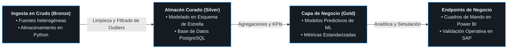

<div align="center">

  <h1>Rodrigo Calderón</h1>
  <h3>Desarrollador de Aplicaciones Multiplataforma · Backend, ERP & Data Pipelines</h3>

  <p>
    <a href="./README.md">English</a> | <b>Español</b>
  </p>

  <p>
    <a href="mailto:roro.calderon@hotmail.com">
      
    </a>
    <a href="https://www.linkedin.com/in/rodrigo-calderon-dev/">
      
    </a>
  </p>

  <p align="center">
    <a href="#sobre-mí">Sobre mí</a> •
    <a href="#stack-tecnológico--herramientas">Stack Tecnológico</a> •
    <a href="#proyectos-destacados">Proyectos Destacados</a> •
    <a href="#contacto">Contacto</a>
  </p>

</div>

---

### Sobre mí

Desarrollador de Software Junior y Técnico Superior en **Desarrollo de Aplicaciones Multiplataforma (DAM)** enfocado en arquitecturas backend, automatización de flujos operativos y tratamiento de datos.

* **Experiencia Profesional:** Desarrollo de módulos de contabilidad interna y facturación recurrente en **C#**, optimizando esquemas de bases de datos relacionales en **BittaSoftware**.
* **Movilidad Internacional:** Co-diseño de un pipeline de ingesta de datos y análisis predictivo en un equipo ágil internacional (Proyecto Rumanía), operando íntegramente en inglés durante la planificación de sprints, sincronizaciones técnicas y revisiones de código.
* **Filosofía Técnica:** Ingeniería de arquitecturas backend limpias, flujos ERP (Odoo) y sustitución de cuellos de botella manuales por servicios automatizados robustos.
* **Objetivo Actual:** En búsqueda de roles de Junior Software Engineer / Backend Developer para integrarme en entornos productivos, colaborar con equipos experimentados y escalar sistemas de software.
* **Ubicación:** Barcelona, España (Abierto a modalidades presenciales e híbridas).

---

### Stack Tecnológico & Herramientas

<div align="center">

| Área | Tecnologías |
| :--- | :--- |
| **Lenguajes** |       |
| **Empresa & Datos** |     |
| **Bases de Datos** |    |
| **Frameworks & Core** |     |

</div>

---

### Proyectos Destacados

---

#### 1. Predictive Real Estate Pipeline & Enterprise Analytics
> Arquitectura Medallion multicapa para el procesamiento de flujos de datos en crudo hacia modelos predictivos y reporting empresarial.


* **Contexto y Colaboración Internacional:** Co-diseñado en un equipo ágil internacional (España, Suiza, Rumanía y Portugal), coordinando dailies, flujos de ramas en Git y entregas técnicas íntegramente en inglés.
* **Arquitectura de Pipeline Medallion:**
  * **Capa Bronze:** Extracción y almacenamiento automatizado de datos inmobiliarios y registros de mercado sin procesar.
  * **Capa Silver:** Depuración de nulos, detección de anomalías y modelado dimensional en estrella dentro de **PostgreSQL**.
  * **Capa Gold:** Ejecución de pipelines de agregación analítica y entrenamiento de modelos predictivos de tendencias con **Pandas** y computación científica.
* **Reporting y Validación Operativa:** Diseño de paneles interactivos en **Power BI** e integración de salidas operativas sobre entornos **SAP** para validar casos de negocio.
* **Impacto:** Reducción del tiempo de preparación de datos de horas de procesamiento manual por sprint a scripts automatizados ejecutables en menos de 2 minutos.
* **Tech Stack:**
  
  
  
  
  

---

#### 2. Enterprise Financial & Invoice Automation
> Módulo de facturación recurrente y automatización contable de alta integridad para operativa empresarial.

```mermaid
flowchart LR
    A["<b>Capa de Cliente (UI)</b><br/>WinForms Desktop (.NET)<br/>• Interfaces Transaccionales<br/>• Validación de Entrada de Datos<br/>• Flujos de Trabajo Modulares"]
    -->|Payloads Seguros HTTPS / JSON| B["<b>Capa de Lógica y API</b><br/>ASP.NET Core REST API<br/>• Controladores y Enrutamiento<br/>• Validación y Reglas de Negocio<br/>• Desacoplamiento de Cliente"]
    -->|ADO.NET y Stored Procedures| C["<b>Capa de Persistencia</b><br/>SQL Server Database<br/>• Procedimientos Almacenados<br/>• Control de Registros Duplicados<br/>• Bloqueos Transaccionales ACID"]
    -->|Pipeline Batch Automatizado| D["<b>Salida de Contabilidad</b><br/>Libro Mayor Empresarial<br/>• Registro Automatizado de Facturas<br/>• Procesamiento Recurrente en Lote<br/>• Informes de Cierre Financiero"]

    classDef default fill:#161b22,stroke:#239120,stroke-width:1.5px,color:#e6edf3;
