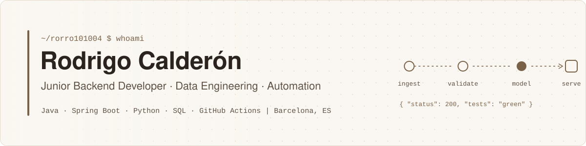
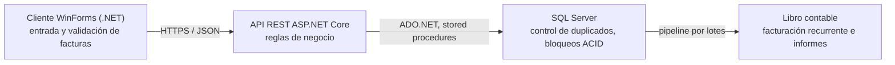
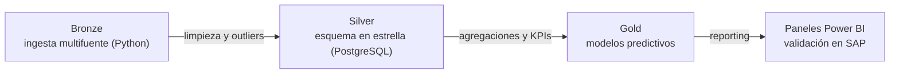
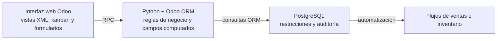
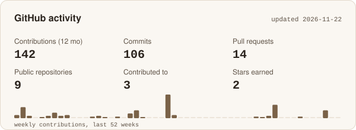
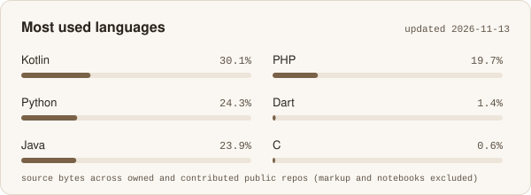

  <a href="./README.md">English</a> · <b>Español</b>

<picture>
  <source media="(prefers-color-scheme: dark)" srcset="assets/banner-dark.svg">
  <source media="(prefers-color-scheme: light)" srcset="assets/banner-light.svg">
  
</picture>

  <a href="#enfoque">Enfoque</a> ·
  <a href="#stack">Stack</a> ·
  <a href="#proyectos-destacados">Proyectos</a> ·
  <a href="#experiencia">Experiencia</a> ·
  <a href="#métricas">Métricas</a> ·
  <a href="#contacto">Contacto</a>

Desarrollador de software junior (Técnico Superior en **Desarrollo de Aplicaciones Multiplataforma, DAM**) con base en **Barcelona**. Construyo servicios backend, pipelines de datos y herramientas de automatización que reemplazan procesos manuales por código probado y mantenible.

## Enfoque

- **Backend:** APIs REST con Java y Spring Boot, modelado relacional e integridad transaccional.
- **Ingeniería de datos:** Pipelines en Python para ingesta, validación y análisis (pandas, SQL).
- **Automatización y calidad:** Integración continua con GitHub Actions, refactorización guiada por tests y herramientas asistidas por IA con puntos de control humano.
- **Búsqueda activa:** Roles de Junior Backend / Data Engineering (presencial, híbrido o remoto). Acostumbrado a trabajar íntegramente en inglés en equipos ágiles internacionales.

## Stack

Cada tecnología listada es trazable a código real en al menos un repositorio público.

| Área | Tecnologías |
| :--- | :--- |
| **Lenguajes** |       |
| **Backend** |     |
| **Datos** |     |
| **Bases de datos** |    |
| **Móvil** |   |
| **Calidad y DevOps** |       |

## Proyectos destacados

| Proyecto | Descripción | Stack | Rol |
| :--- | :--- | :--- | :--- |
| [**ZeroBreak**](https://github.com/Rorro101004/ZeroBreak) | Framework SDD y CLI para refactorizar Python sin romper contratos: línea base con pytest, guardas de integridad SHA-256, copia de respaldo didáctica, aplicación protegida con rollback automático y generación de tests con Golden Master e Hypothesis. CI en Ubuntu y Windows, 100 % de cobertura. | Python 3.12, pytest, Hypothesis, ruff, mypy, GitHub Actions | Autor |
| **EasyTeeth** · [API](https://github.com/JoanMarcMM/EasyTeeth_BackEnd) · [Android](https://github.com/JoanMarcMM/EasyTeeth_FrontEnd) | Gestión de clínica dental: turnos de citas, asignación de boxes clínicos e historial de pacientes. API REST con documentación OpenAPI y cliente nativo Android. Proyecto de 9 meses, equipo de 4. | Spring Boot 4, JPA, MySQL, Kotlin, Compose, Retrofit | Capa de red en Android y endpoints REST |
| [**Hospital API**](https://github.com/JoanMarcMM/Hospital_Project) | API REST para gestión de enfermería: CRUD, búsqueda y autenticación, con tests de controlador, colección Postman y CI. Equipo de 4. | Spring Boot, Maven, JUnit, Postman, GitHub Actions | Desarrollador backend |
| [**People MVC (Foxtrot)**](https://github.com/Joan735/Foxtrot) | Aplicación CRUD multi-almacenamiento bajo arquitectura MVC estricta con persistencia intercambiable (SQL, ObjectDB, ficheros), suite JUnit 5 y CI con Maven. | Java 17, MySQL, ObjectDB, JUnit 5, GitHub Actions | Coautor (37 commits) |
| [**Capa de acceso a datos**](https://github.com/Rorro101004/RA1AccesoAdatos) | Sistema de gestión de tienda que intercambia motores de persistencia tras una interfaz DAO: JDBC, Hibernate, MongoDB y ObjectDB. | Java 17, JDBC, Hibernate, MongoDB, Maven | Autor |
| **Notebooks de datos** · [EDA](https://github.com/Rorro101004/RA3-DataSets) · [Prueba ETL](https://github.com/Rorro101004/PruebaTecnica) | Análisis exploratorio de ventas de videojuegos (ingeniería de variables, cortes regionales, outliers) y ejercicio de ingeniería de datos: normalización, validación, hashes de deduplicación y carga en SQLite con aserciones. | pandas, NumPy, seaborn, sqlite3 | Autor |
| [**NexTech**](https://github.com/Rorro101004/Nextech) | Plataforma de eventos tecnológicos con registro de usuarios, autenticación y CRUD de eventos sobre una estructura MVC en PHP. Equipo de 3. | PHP, MVC, CSS | Project manager y backend |

## Experiencia

<b>Desarrollador de Software en Prácticas · BittaSoftware</b> - automatización contable y facturación recurrente (código privado)

 

```mermaid
flowchart LR
    A["Cliente WinForms (.NET)<br/>entrada y validación de facturas"] -->|HTTPS / JSON| B["API REST ASP.NET Core<br/>reglas de negocio"]
    B -->|ADO.NET, stored procedures| C["SQL Server<br/>control de duplicados, bloqueos ACID"]
    C -->|pipeline por lotes| D["Libro contable<br/>facturación recurrente e informes"]
```

- Desarrollo de interfaces de escritorio transaccionales en **WinForms (.NET)** conectadas a una capa REST en **ASP.NET Core**.
- Programación de procedimientos almacenados y validaciones en **SQL Server** para evitar facturas duplicadas bajo concurrencia.
- Trabajo en una unidad de 2 personas junto a la desarrolladora sénior (pair programming y revisión de código).
- Impacto: sustitución de carga manual entre hojas de cálculo, ahorrando entre 5 y 7 horas administrativas por semana.

<b>Proyecto internacional (Rumanía)</b> - pipeline predictivo inmobiliario y analítica (código privado)

 

```mermaid
flowchart LR
    A["Bronze<br/>ingesta multifuente (Python)"] -->|limpieza y outliers| B["Silver<br/>esquema en estrella (PostgreSQL)"]
    B -->|agregaciones y KPIs| C["Gold<br/>modelos predictivos"]
    C -->|reporting| D["Paneles Power BI<br/>validación en SAP"]
```

- Pipeline con arquitectura Medallion co-diseñado en un equipo ágil internacional (España, Suiza, Rumanía y Portugal), trabajando íntegramente en inglés.
- Capa Silver modelada en **PostgreSQL**; agregaciones y modelos predictivos en capa Gold con **pandas**.
- Cuadros de mando en **Power BI** y mapeo de salidas operativas hacia **SAP**.
- Impacto: reducción de la preparación manual de datos de horas por sprint a ejecuciones automatizadas en menos de 2 minutos.

<b>Proyecto académico · STUCOM</b> - módulos ERP a medida en Odoo (código privado)

 

```mermaid
flowchart LR
    A["Interfaz web Odoo<br/>vistas XML, kanban y formularios"] -->|RPC| B["Python + Odoo ORM<br/>reglas de negocio y campos computados"]
    B -->|consultas ORM| C["PostgreSQL<br/>restricciones y auditoría"]
    C -->|automatización| D["Flujos de ventas e inventario"]
```

- Extensiones modulares en **Python** con el **ORM de Odoo** para automatizar flujos de ventas e inventario en un equipo de 3 desarrolladores.
- Restricciones relacionales y sincronización automatizada de registros sobre **PostgreSQL**.

## Métricas

  <picture>
    <source media="(prefers-color-scheme: dark)" srcset="assets/metrics/stats-dark.svg">
    <source media="(prefers-color-scheme: light)" srcset="assets/metrics/stats-light.svg">
    
  </picture>
  <picture>
    <source media="(prefers-color-scheme: dark)" srcset="assets/metrics/languages-dark.svg">
    <source media="(prefers-color-scheme: light)" srcset="assets/metrics/languages-light.svg">
    
  </picture>

Generadas diariamente mediante un workflow de GitHub Actions en este repositorio, sin depender de servicios externos.

## Contacto

Disponible para posiciones de **Junior Backend Developer**, **Data Engineering** y **ERP / automatización**.

