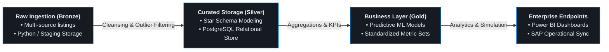
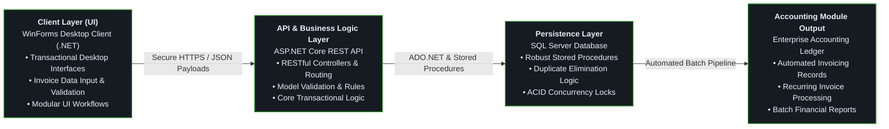
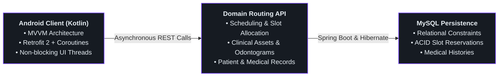
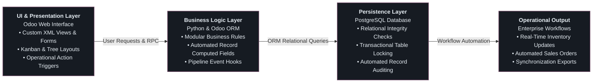
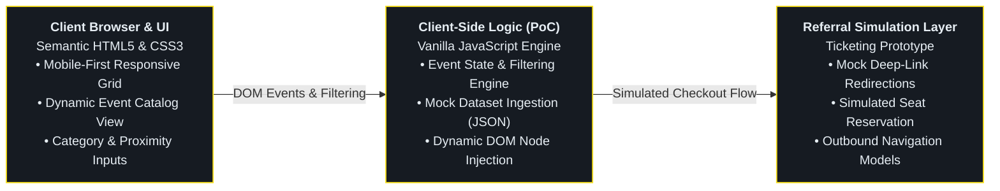

  <h1>Rodrigo Calderón</h1>
  <h3>Multiplatform Application Developer · Backend, ERP & Data Pipelines</h3>
  

    <b>English</b> | <a href="./README.es.md">Español</a>
  

  

    
    
  

  

  <a href="#about-me">About Me</a> •
  <a href="#tech-stack--tooling">Tech Stack</a> •
  <a href="#featured-projects">Featured Projects</a> •
  <a href="#lets-connect">Contact</a>

---
### About Me

Junior Software Developer and Higher Technician in **Multiplatform Application Development (DAM)** focused on backend architectures, workflow automation, and data handling.

* **Professional Experience:** Developed internal accounting and automated invoicing modules in **C#** and optimized relational databases at **BittaSoftware**.
* **International Mobility:** Co-designed data ingestion and predictive analytics software within a cross-border agile team (Romania Project), operating entirely in English across sprint planning, technical syncs, and codebase collaboration.
* **Core Philosophy:** Engineering maintainable backend architectures, ERP workflows (Odoo), and replacing manual operational bottlenecks with robust automated services.
* **Current Objective:** Seeking Junior Software Engineer / Backend Developer opportunities to contribute to production environments, collaborate with experienced engineering teams, and expand scalable software systems.
* **Location:** Barcelona, Spain (Open to hybrid and remote opportunities).

---

### Tech Stack & Tooling

| Area | Technologies |
| :--- | :--- |
| **Languages** |       |
| **Enterprise & Data** |     |
| **Databases** |    |
| **Frameworks & Core** |     |

---

### Featured Projects

---

#### 1. Predictive Real Estate Pipeline & Enterprise Analytics
> Multi-layer Medallion Architecture processing raw ingestion streams into predictive models and enterprise reporting.

* **Context & International Collaboration:** Co-engineered in an English-speaking cross-border agile team (Spain, Switzerland, Romania, Portugal), driving daily standups, Git branch workflows, and technical handoffs entirely in English.
* **Medallion Pipeline Architecture:**
  * **Bronze Layer:** Automated extraction and ingestion of unstructured real estate and market feeds.
  * **Silver Layer:** Cleaned datasets, resolved missing dimensions, and structured normalized dimensional models inside **PostgreSQL**.
  * **Gold Layer:** Executed metric aggregation pipelines and trained predictive algorithms using **Pandas** and scientific computing modules.
* **Enterprise Reporting & Business Validation:** Designed stakeholder dashboards in **Power BI** and mapped outputs into **SAP** environments to validate business operations.
* **Impact:** Reduced manual dataset wrangling from hours per sprint to scripted end-to-end pipelines running in under 2 minutes.
* **Tech Stack:**
  
  
  
  
  

---

#### 2. Enterprise Financial & Invoice Automation
> High-integrity accounting and recurring invoice automation module built for core enterprise operations.

* **Context & Team Structure:** Developed in production during software developer internship at **BittaSoftware**, collaborating directly in a 2-person engineering unit alongside the Senior Lead Developer through pair programming and code reviews.
* **Architecture & UI:** Developed transactional desktop interfaces using **WinForms (.NET)**, integrating modular UI workflows with backend business logic.
* **API & Routing:** Implemented RESTful controllers and endpoint routing in **ASP.NET Core** to decouple desktop clients from database operations and secure data payloads.
* **Transaction Safety:** Structured robust SQL Server stored procedures and validation logic to eliminate duplicate invoice records and handle concurrency.
* **Impact:** Replaced manual cross-spreadsheet data entry, saving 5–7 administrative hours weekly.
* **Tech Stack:**
  
  
  
  
  

---

#### 3. EasyTeeth · Clinical Scheduling & Dental Management System
> Distributed multiplatform system coordinating real-time clinical box allocation, odontologist schedules, and patient records.

* **Context & Team Collaboration:** Co-engineered across a 9-month lifecycle (September to May) in a 4-developer engineering team at STUCOM (Barcelona), driving sprint iterations, Git branching strategies, and full ownership of mobile network architecture.
* **Mobile Client:** Built a native mobile interface in **Android Studio using Kotlin**, consuming asynchronous REST endpoints and managing real-time inventory states.
* **Backend Architecture:** Developed a decoupled REST API with **Java & Spring Boot**, handling business logic, resource routing, and secure payload serialization.
* **API Testing & Documentation:** Validated HTTP methods, request headers, and response payloads using **Postman** (contract testing and endpoint simulation).
* **Concurrency Control:** Engineered transactional database locks in **MySQL** to eliminate race conditions and prevent double-booking of surgical boxes.
* **Tech Stack:** 
  
  
  
  
  
  

---

#### 4. Custom ERP & Business Workflow Automation
> Custom module development, business logic extension, and data integration within Odoo ecosystem.

* **Context & Team Collaboration:** Co-developed within a 3-developer team at STUCOM (Barcelona), collaborating on module specifications, version control workflows, and business requirement mapping.
* **Architecture:** Developed modular extensions using **Python** and **Odoo ORM** to automate sales and inventory operational flows.
* **Data Integration:** Designed relational database constraints and automated record synchronization backed by **PostgreSQL**.
* **Tech Stack:**
  
  
  

  ---

#### 5. NexTech · Tech Event Discovery & Ticketing Portal
> Geolocation-aware discovery platform aggregating regional tech events with direct ticketing routing.

* **Context & Team Collaboration:** Built in a 3-developer team at STUCOM (Barcelona) as a frontend Proof of Concept (PoC) to benchmark vanilla JavaScript DOM rendering speeds and simulate user journeys.
* **Client-Side Architecture:** Implemented dynamic filtering algorithms in **vanilla JavaScript** using structured mock JSON datasets to simulate real-time search queries by category and proximity.
* **Referral Flow Simulation:** Designed deep-linking outbound patterns to emulate user handoffs to third-party vendor platforms for ticket checkout and seat allocations.
* **Zero-Dependency Styling:** Structured a lightweight, mobile-first interface using semantic **HTML5** and modern **CSS3** (Flexbox/Grid), eliminating heavy UI framework overhead.
* **Tech Stack:**
  
  
  
---

### Let's Connect

I am currently open to **Junior Backend Developer**, **Data Engineering**, and **ERP Consulting** roles in Barcelona (hybrid or on-site).

Feel free to reach out for technical inquiries, project collaborations, or engineering opportunities.
